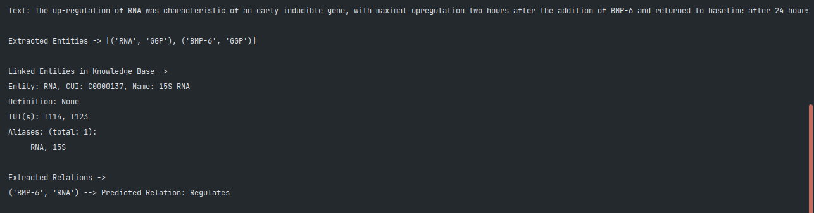

# NER-RE
A Named Entity Recognition + Relation Extraction Pipeline built using spaCy v3.0. Given a text, the pipeline will extract entites from the text as trained and will assign a relation between the entities, if any.

There are two separate models: A Named Entity Recognition Model and Relation Extraction Model.

Information extraction from unstructured texts – contracts, financial papers, healthcare records, and so on — is one of the most useful applications of Natural Language Processing (NLP), as it enables autonomous data query to derive fresh insights. Named entity recognition (NER) has long been used to recognise entities inside a text and retain the information for sophisticated querying and filtering. However, because we don't know how the entities are related to one another, NER alone isn't adequate to grasp the unstructured text meaningfully. Joint NER and relation extraction  (RE) offers up a whole new approach of retrieving information using knowledge graphs, where we may travel between nodes to identify hidden relationships. As a result, completing these two tasks together can be very useful.

Here, we fine-tune a transformers model for NER using spaCy v3, and on top of it, we add relation extraction as well to the pipeline finetuning a transformers model.

At its core, the relation extraction model is a classifier that predicts a relation `r` for a given pair of entity `{e1, e2}`. In case of transformers, this classifier is added on top of the output hidden states. The pre-trained model that we are going to fine-tune is a BERT model but any pre-trained model available in huggingface library can be used by simply inputting the name in the config files.

Sample annotated data for training can be found inside the assets directory of both the model folders. This repository contains code for training NER and RE models and then using them together using the PipelineModel class from ``PipelineModel.py`` python script. Codebase for both the models follow spaCy's recommended file structuring.

### Screenshot:

### Important Commands:

The following commands are common to both the models:

- To run the whole flow:
	* `spacy project run all_gpu` (Using GPU)
	* `spacy project run all` (Using CPU)

P.S. : If using CPU, model will not use transformers and will be trained using tok2vec instead.

- All runnable commands are mentioned in project.yaml

- For training, three annotated files are needed: 
	* annotations_train.jsonl
	* annotations_dev.jsonl
	* annotations_test.jsonl

### Note:

Ensure all modules and libraries mentioned in requirements.txt are installed before running the project.